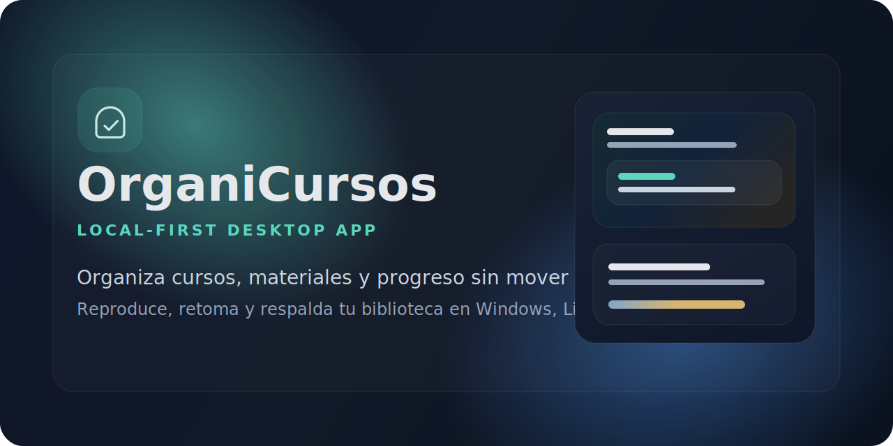

<p align="center">
  
</p>

<h1 align="center">OrganiCursos</h1>

<p align="center">
  Biblioteca de escritorio <strong>local-first</strong> para organizar cursos, clases y materiales de estudio sin depender de la nube.
</p>

<p align="center">
  <a href="https://zolvek-mx.web.app">Sitio</a> ·
  <a href="https://github.com/f-lopez-velazquez/organicursos/releases">Descargas</a> ·
  <a href="https://github.com/f-lopez-velazquez/organicursos/issues">Soporte</a> ·
  <a href="https://paypal.me/FranciscoLopezVzqz">Donativos</a>
</p>

<p align="center">
  <a href="https://github.com/f-lopez-velazquez/organicursos/releases">
    
  </a>
  <a href="https://github.com/f-lopez-velazquez/organicursos/actions/workflows/ci.yml">
    
  </a>
  <a href="LICENSE">
    
  </a>
</p>

OrganiCursos es una aplicación de escritorio `local-first` para organizar cursos, clases y materiales de estudio sin mover los archivos del usuario a la nube. Está enfocada en bibliotecas grandes de video, documentos, subtítulos y recursos de apoyo, con especial cuidado en continuidad de estudio, privacidad, rendimiento y operación offline.

> Creado y mantenido por Francisco López Velázquez. El proyecto se publica como software libre bajo licencia MIT y puede apoyarse mediante donativos voluntarios.

## Resumen

- organiza carpetas de cursos sin alterar la estructura original
- conserva el punto exacto de cada clase, junto con velocidad y volumen
- reúne materiales, subtítulos, notas y marcadores en una sola vista
- distribuye builds para Linux y deja preparado el flujo de release para Windows y macOS
- separa código fuente y artefactos para mantener el repositorio limpio y profesional

## Instalación

La forma más simple para usuarios finales es descargar los artefactos desde la sección de Releases del repositorio.

### Descargas rápidas

- Releases: https://github.com/f-lopez-velazquez/organicursos/releases
- Código fuente: https://github.com/f-lopez-velazquez/organicursos
- Sitio del proyecto: https://zolvek-mx.web.app

### Compatibilidad actual

| Plataforma | Estado | Formato principal | Notas |
|---|---|---|---|
| Windows 10/11 x64 | Preparado | `setup.exe`, `msi` | Flujo de build incluido en scripts y workflow |
| Linux Mint / Ubuntu / Debian | Listo | `.deb`, `AppImage` | Instalación directa desde release |
| Arch / CachyOS | Listo | `.pkg.tar.zst` | Instalación con `pacman -U` |
| macOS Apple Silicon / Intel | Preparado | `.app`, `.dmg` | Requiere validación y firma en hardware macOS |

### Enlaces del proyecto

- Sitio principal: https://zolvek-mx.web.app
- Donativos: https://paypal.me/FranciscoLopezVzqz
- Repositorio: https://github.com/f-lopez-velazquez/organicursos
- Issues: https://github.com/f-lopez-velazquez/organicursos/issues

### Linux

- `AppImage`: ejecutar directamente.
- `deb`: instalar en Debian, Ubuntu, Linux Mint y derivadas.
- `pkg.tar.zst`: instalar en Arch, CachyOS y derivadas con `pacman -U`.

Ejemplo para CachyOS o Arch:

```bash
sudo pacman -U ./organicursos-0.1.0-1-x86_64.pkg.tar.zst
```

### Windows

- instalador `setup.exe` para la mayoría de usuarios
- `msi` para despliegues administrados

### macOS

- el flujo de build está preparado, pero debe validarse y firmarse en hardware macOS antes de distribución pública final

### Sobre “cualquier dispositivo”

OrganiCursos ya queda bien encaminado para los principales sistemas de escritorio. Si más adelante quieres cubrir también móviles o tablets, eso ya sería otro frente de producto y de interfaz, no solo de empaquetado.

## Qué resuelve

- Organiza carpetas de cursos sin alterar la estructura original.
- Detecta videos, PDFs, subtítulos, audios y archivos de apoyo.
- Guarda el avance de cada clase y la retoma desde el punto exacto.
- Permite notas, marcadores y búsqueda local.
- Ofrece ayudas opcionales para enriquecer descripciones, etiquetas y agrupación.
- Exporta e importa respaldos para mover el trabajo entre equipos.

## Stack técnico

- `Tauri v2`
- `React 18 + TypeScript + Vite`
- `Rust`
- `Zustand`
- `SQLite + FTS5`
- `sqlite-vec`
- `ffmpeg` y `ffprobe` como sidecars

## Principios operativos

- `Local-first`: el contenido principal se procesa y persiste en el equipo del usuario.
- `Privacidad explícita`: cualquier ayuda remota se mantiene como opt-in.
- `Reproducción seria`: el player conserva progreso, velocidad, volumen y estado de la clase.
- `Distribución multiplataforma`: hay scripts para Windows, macOS y Linux, incluyendo paquete nativo para Arch/CachyOS y entregables listos para release.
- `Código abierto`: el repositorio se publica bajo MIT y queda listo para revisarse, extenderse y redistribuirse con atribución.

## Desarrollo local

### Requisitos

- `Node.js 20+`
- `npm`
- `Rust + cargo`
- dependencias del sistema necesarias para `Tauri`

### Comandos base

```bash
npm install
npm run build
npm test
npm run tauri dev
```

## Scripts útiles

```bash
npm run build
npm run test
npm run lint
npm run build:windows:release
npm run build:macos:release
npm run build:linux:release
npm run build:cachyos:package
npm run deliver:linux:cachyos
npm run prepare:linux:share
```

## Flujo de releases

- `CI` valida frontend y chequeos de escritorio
- `Release Bundles` compila artefactos por plataforma
- las releases públicas se pueden preparar desde tags `v*`
- los instaladores viven en Releases, no dentro del historial del repo

## Distribución por plataforma

### Linux y CachyOS

Para generar artefactos Linux:

```bash
npm run build:linux:release
npm run prepare:linux:share
```

Para generar además el paquete nativo de Arch/CachyOS:

```bash
npm run deliver:linux:cachyos
```

La salida de distribución queda en `ENTREGA/` durante los procesos locales de release, pero esa carpeta se ignora para publicación del repositorio.

### Windows

```bash
npm run build:windows:release
```

Salida esperada:
- instalador `NSIS`
- paquete `MSI`

### macOS

```bash
npm run build:macos:release -- --arch arm64
```

Salida esperada:
- bundle `.app`
- imagen `.dmg`

## Estructura del proyecto

```text
.
|-- docs/
|-- fixtures/
|-- scripts/
|-- src/
|-- src-tauri/
|-- EULA.md
|-- LICENSE
|-- package.json
`-- README.md
```

### Directorios principales

- `src/`: interfaz, flujos de aplicación y servicios del frontend.
- `src-tauri/`: backend de escritorio, base de datos, comandos y empaquetado.
- `scripts/`: automatizaciones de build, staging y release.
- `docs/`: arquitectura, licenciamiento, distribución y operación comercial.

## Calidad y validación

Antes de publicar un cambio conviene ejecutar:

```bash
npm test
npm run build
```

En cambios de escritorio o empaquetado también conviene validar:

```bash
npm run build:linux:release
npm run build:cachyos:package
```

## Publicación del repositorio

Este proyecto está organizado para que el código fuente se publique sin incluir artefactos generados, cachés, bases locales ni entregables pesados. El `.gitignore` excluye las rutas de trabajo y distribución que solo deben existir en el entorno de build.

## Colaboración

Las contribuciones se reciben vía pull requests y reportes de issues. Para mantener el repositorio claro y trazable, conviene revisar antes:

- [Guía de contribución](CONTRIBUTING.md)
- [Política de seguridad](SECURITY.md)
- [Código de conducta](CODE_OF_CONDUCT.md)

## Autor y apoyo

- Autor: Francisco López Velázquez
- Sitio: https://zolvek-mx.web.app
- Contacto: f.lopezvelazquez@ugto.mx
- Donativos: https://paypal.me/FranciscoLopezVzqz

## Proceso de release

Los instaladores y paquetes se preparan con automatización por CLI sobre `npm`, `cargo`, `Tauri CLI` y herramientas nativas de cada plataforma. Eso permite reproducir builds, revisar pasos críticos y mantener una entrega consistente entre sistemas operativos.

## Estado del proyecto

- base funcional de escritorio lista para bibliotecas locales
- empaquetado Linux validado con AppImage, `.deb` y paquete nativo para Arch/CachyOS
- workflow de publicación preparado para mantener código, documentación y entregables de forma separada
- estructura del repo lista para seguir creciendo como producto público

## Documentación complementaria

- [Arquitectura](docs/architecture.md)
- [Checklist de release](docs/release-checklist.md)
- [Distribución por plataforma](docs/platform-distribution.md)
- [Licenciamiento](docs/licensing.md)
- [Readiness comercial](docs/commercial-readiness.md)
